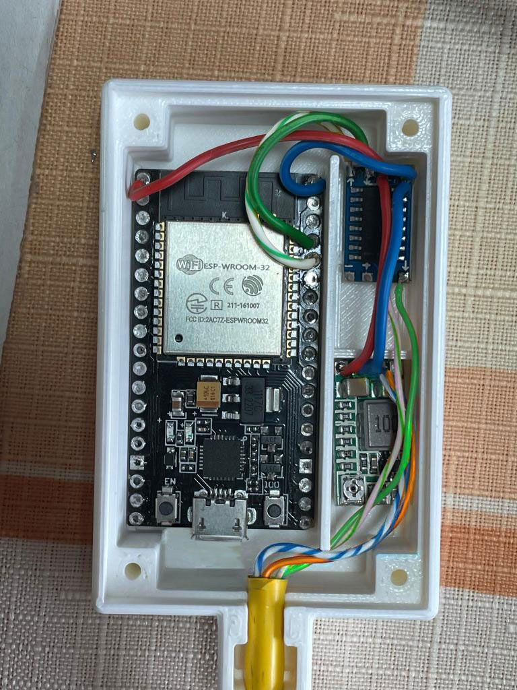
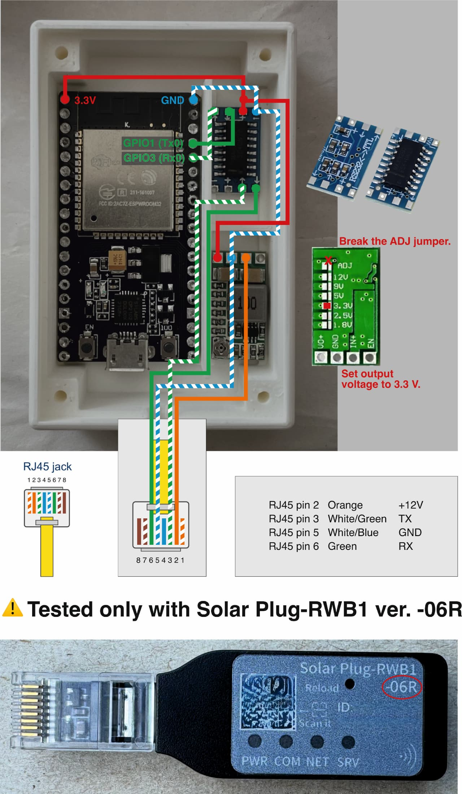

# EASUN SMT-III ESPHome Integration

ESPHome external component and hardware notes for monitoring and controlling an EASUN SMT-III inverter from Home Assistant over the inverter RS232 communication port.

This repository was created as a practical guide while connecting one specific inverter to Home Assistant. It may help other users, but every inverter and Solar Plug board revision must be verified before wiring anything.



*Assembled example for Solar Plug-RWB1 ver. -06R. Always verify your own hardware before connecting anything.*

## Important Warnings

> [!WARNING]
> This project is an independent implementation based on protocol analysis of the EASUN SMT-III inverter communication. It is not affiliated with, endorsed by, or supported by EASUN.

> [!WARNING]
> No warranty is provided. You use this project, wiring information, schematics, firmware, configuration, and documentation entirely at your own risk. The author accepts no liability for damage to equipment, batteries, property, data, personal injury, fire, electrical hazards, incorrect inverter operation, or any other loss or damage.

> [!CAUTION]
> The wiring shown here is for **Solar Plug-RWB1 ver. -06R** only. There are multiple versions of the inverter control board / Solar Plug and the RJ45 pinout may be different. Always verify the pins on your own hardware before connecting an ESP32, RS232 converter, power supply, or any other device.

## What Is Included

- ESPHome external component for EASUN SMT-III communication.
- Example ESPHome YAML configuration for Home Assistant.
- Wiring notes for ESP32, MAX3232 RS232 to TTL converter, DC-DC step-down power supply, and RJ45 cable.
- Optional protocol sniffer configuration and wiring for analyzing the inverter / Solar Plug communication.
- Photos, diagrams, and 3D printable case files.
- Solar Plug-RWB1 user manual PDF for reference.

## Hardware Used

- ESP32 DevKit
- MAX3232 RS232 to TTL converter
- DC-DC step-down converter, 12 V to 3.3 V
- RJ45 cable
- 3D printed ESP32 enclosure

## Wiring Overview

For the full wiring notes, see [`docs/WIRING.md`](docs/WIRING.md).

Wiring photo:



Connection diagram:

```text
⚠️ WARNING: Solar Plug-RWB1 ver. -06R only

                RS232                UART-TTL
+------------+          +---------+              +----------+
|  SMT-III   |          | MAX3232 |              |  ESP32   |
|            |          |         |              |          |
|          3 | TX ----->| RX      | TX TTL ----->| RX GPIO3 |
|          6 | RX <-----| TX      | RX TTL <-----| TX GPIO1 |
|          5 | GND -----| GND     | GND ---------| GND      |
|            |          |         | VCC (+)      | 3.3V     |
|          2 | 12V --+  +---------+              +----------+
+------------+       |
                     v
                    IN+
            Step-down 12V -> 3.3V
                    VO+
                     |
                     +-- ESP32 3V3
                     +-- MAX3232 VCC (+)
```

## RJ45 Pinout

⚠️ For **Solar Plug-RWB1 ver. -06R**:

| RJ45 pin | T-568B color | Description | MAX3232 pin | ESP32 pin | DC-DC power supply |
| --- | --- | --- | --- | --- | --- |
| 2 | Orange | VCC +12 V | - | - | IN+ |
| 3 | White-Green | TX | RX | RX GPIO3 | - |
| 5 | White-Blue | GND | GND | GND | GND |
| 6 | Green | RX | TX | TX GPIO1 | - |

## ESPHome Installation

See [`docs/INSTALLATION.md`](docs/INSTALLATION.md).

Short version:

1. Copy the `components/easun_smt_iii` directory into your ESPHome configuration directory.
2. Use [`examples/easun3-with-component.yaml`](examples/easun3-with-component.yaml) as a starting point.
3. Set Wi-Fi, OTA, API secrets, and board-specific options.
4. Compile and flash with ESPHome.
5. Add the ESPHome device to Home Assistant.

## Repository Layout

```text
.
├── assets/
│   ├── diagrams/        # RJ45 and wiring diagrams
│   └── photos/          # Wiring and enclosure photos
├── components/          # ESPHome external component
├── docs/                # Manuals, installation and wiring documentation
├── examples/            # Example ESPHome YAML files
├── hardware/
│   ├── case/            # STL / 3D model files
│   └── schematics/      # Wiring schematics and source drawings
├── LICENSE
└── README.md
```

## Assets

Repository assets are listed in [`docs/ASSETS.md`](docs/ASSETS.md).

## Protocol Notes

Protocol research notes are documented in [`docs/PROTOCOL.md`](docs/PROTOCOL.md). These notes describe observed communication behavior only and should not be treated as an official EASUN protocol specification.

## Protocol Sniffer

For analyzing the inverter / Solar Plug communication or reverse engineering unsupported commands, an optional passive serial sniffer is documented in [`docs/SNIFFER.md`](docs/SNIFFER.md), with the ESPHome configuration in [`examples/rs232-sniffer.yaml`](examples/rs232-sniffer.yaml). The wiring is specific to **Solar Plug-RWB1 ver. -06R**.

## Sponsoring

If you find this project useful, you can support its development through [GitHub Sponsors](https://github.com/sponsors/ljulina), [Ko-fi](https://ko-fi.com/ljulina), [Buy Me a Coffee](https://buymeacoffee.com/ljulina), or [PayPal](https://www.paypal.com/paypalme/ljulinacz).

See [`docs/SPONSORING.md`](docs/SPONSORING.md) for more information.

## License

This project is licensed under the MIT License. See [`LICENSE`](LICENSE).
