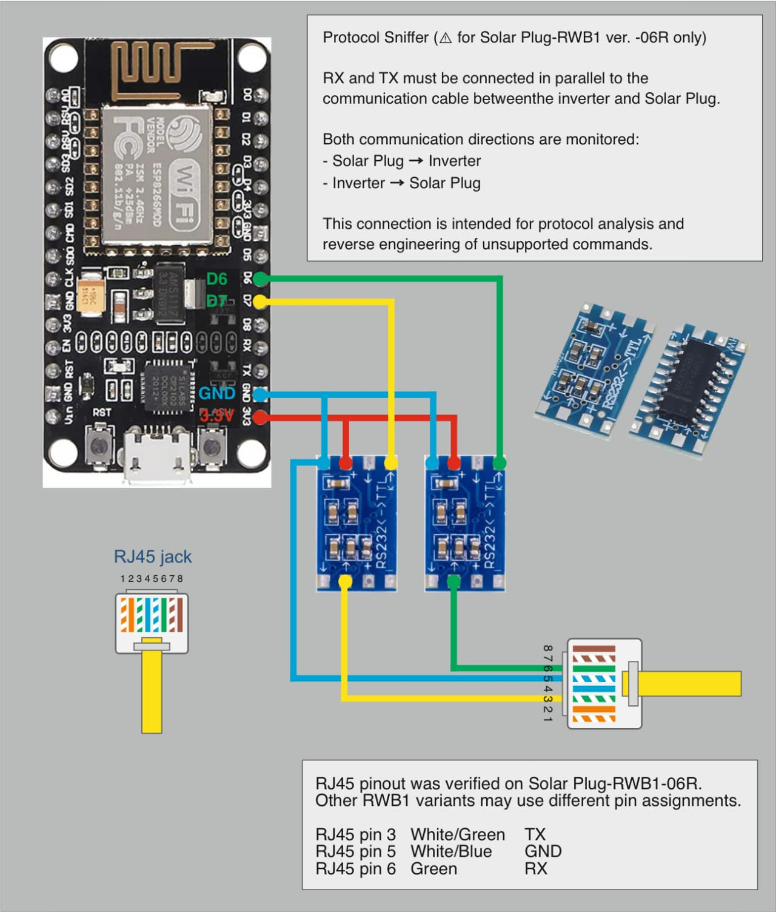

# Protocol Sniffer

> [!WARNING]
> This sniffer wiring is documented for **Solar Plug-RWB1 ver. -06R** only. It is not a generic RX/TX sniffer - the RJ45 pinout and connection are tied to this specific Solar Plug. Other board revisions may use a different pinout. Verify every pin with your own hardware before connecting anything.

> [!WARNING]
> No warranty is provided. Incorrect wiring can damage the inverter, ESP, RS232 converter, or connected equipment. Use this information at your own risk.

## Purpose

The sniffer passively listens to the serial communication between the EASUN SMT-III inverter and the Solar Plug-RWB1. It was used to analyze the protocol and reverse engineer commands that the ESPHome component does not support yet.

Both communication directions are captured:

- **Inverter → Solar Plug** (data sent by the inverter)
- **Solar Plug → Inverter** (data sent by the Solar Plug)

The ESP only connects the **RX** lines of two RS232-to-TTL converters in **parallel** with the existing communication cable. Nothing is transmitted back, so the sniffer is read-only and does not change the live communication.

## Wiring



- Two RS232-to-TTL converters share the same **3.3 V** and **GND** from the ESP.
- Each converter taps one direction of the communication cable and feeds its TTL **RX** into one ESP GPIO.
- ESP8266 (NodeMCU) pins used in the example:
  - `D7` → inverter direction (`uart_inverter`)
  - `D6` → Solar Plug direction (`uart_solar`)

### RJ45 Pinout

For **Solar Plug-RWB1 ver. -06R** (verified on the tested unit only):

| RJ45 pin | T-568B color | Description |
| --- | --- | --- |
| 3 | White-Green | TX |
| 5 | White-Blue | GND |
| 6 | Green | RX |

## Tools Used

- ESP8266 NodeMCU (any ESP with two usable UART RX pins works; the example uses software-serial RX on `D6` / `D7`).
- Two RS232-to-TTL converters.
- ESPHome with UART debug logging.

## Usage

1. Wire the sniffer as shown above and double-check the RJ45 pinout for your board revision.
2. Flash [`examples/rs232-sniffer.yaml`](../examples/rs232-sniffer.yaml) with ESPHome.
3. Open the ESPHome logs. Each captured frame is logged twice:
   - `RAW:` printable ASCII (non-printable bytes shown as `.`)
   - `HEX:` raw byte values
4. The log tags distinguish the direction:
   - `inverter_tx` - data sent by the inverter
   - `solar_tx` - data sent by the Solar Plug

Example log line:

```text
[D][inverter_tx]: RAW: (00 B1010010 11721000000 ...
[D][inverter_tx]: HEX: 28 30 30 20 42 31 30 31 ...
```

## Notes

- Capture both directions to see the full request/response exchange.
- When sharing captures, remove any private or device-specific information (serial numbers, etc.).
- Decoded fields and observations are documented in [`PROTOCOL.md`](PROTOCOL.md).
